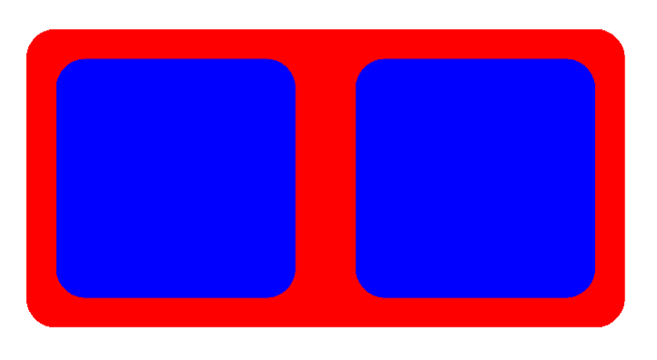
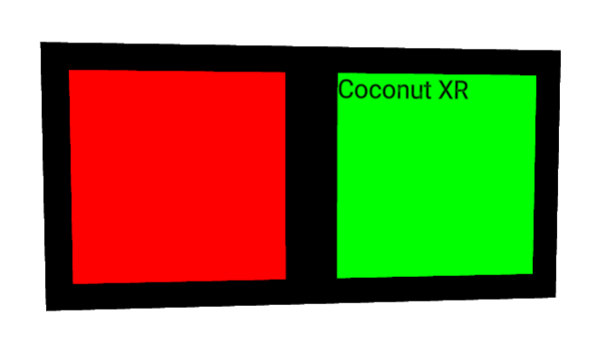

# Advanced

## Precision

The unit for expressing sizes in 2D layouts often corresponds to pixels. However, in 3D layouts, no such uniform unit exists. For use cases like WebXR, 1 unit should correspond to 1 meter. However, in other use cases, another unit is more reasonable. We provide the `precision` parameter on the root component to support different units. The default precision is `0.001`. The precision expresses the smallest possible difference between two values. The precision also influences the z-offset between nested components. If z-fighting occurs, the precision should be increased.

## Classes and DefaultStyleProvider

**Koestlich** implements support for classes and inherited property values. The following code shows how classes and the `DefaultStyleProvider` can reduce style descriptions. In the following example, one `DefaultStyleProvider` sets the `borderRadius` to `0.1` for all `Containers`. The `borderRadius` style is inherited and extended with `margin = 0.1` from a second `DefaultStyleProvider`. The constant `blue` acts as a CSS class and assigns the `backgroundColor` to two components.

[CodeSandbox](https://codesandbox.io/s/koestlich-classes-defaults-85cdb6?file=/src/app.tsx)



```tsx
import { Canvas } from "@react-three/fiber";
import { OrbitControls } from "@react-three/drei";
import { RootContainer, Container, flexAPI, DefaultStyleProvider } from "@coconut-xr/koestlich";
import { loadYoga } from "@coconut-xr/flex";

const blue = {
  backgroundColor: "blue",
};

export default function App() {
  return (
    <Canvas>
      <OrbitControls enableRotate={false} />
      <DefaultStyleProvider borderRadius={0.1}>
        <RootContainer
          loadYoga={loadYoga}
          backgroundColor="red"
          width={2}
          height={1}
          flexDirection="row"
        >
          <DefaultStyleProvider margin={0.1}>
            <Container flexGrow={1} classes={[blue]} />
            <Container flexGrow={1} classes={[blue]} />
          </DefaultStyleProvider>
        </RootContainer>
      </DefaultStyleProvider>
    </Canvas>
  );
}
```

## Custom Property APIs

**Koestlich** allows the creation of custom properties for multiple component types. For example, in the following, we create the `variant` property, which takes the values `danger` and `success` and sets the background colors `red` and `green`, respectively, on components of the type image and container.

[CodeSandbox](https://codesandbox.io/s/koestlich-custom-api-z77pr6?file=/src/app.tsx)



```tsx
import { Canvas } from "@react-three/fiber";
import { OrbitControls } from "@react-three/drei";
import {
  RootContainer,
  flexAPI,
  buildComponent,
  ContainerNode,
  useContainer,
  useText,
  TextNode,
} from "@coconut-xr/koestlich";
import { loadYoga } from "@coconut-xr/flex";
import { Suspense } from "react";

const customAPI = {
  ...flexAPI,
  variant: (target: any, value: "danger" | "success") => {
    target.backgroundColor = {
      danger: 0xff0000,
      success: 0x00ff00,
    }[value];
  },
};

const CustomContainer = buildComponent(ContainerNode, useContainer, customAPI);
const CustomText = buildComponent(TextNode, useText, customAPI);

export default function App() {
  return (
    <Canvas>
      <OrbitControls />
      <RootContainer
        loadYoga={loadYoga}
        backgroundColor="black"
        width={2}
        height={1}
        flexDirection="row"
      >
        <CustomContainer margin={0.1} index={0} flexGrow={1} variant="danger" />
        <Suspense>
          <CustomText index={1} flexGrow={1} flexBasis={0} variant="success" margin={0.1}>
            Coconut XR
          </CustomText>
        </Suspense>
      </RootContainer>
    </Canvas>
  );
}
```