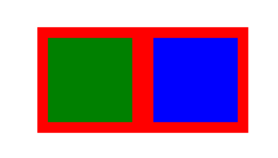
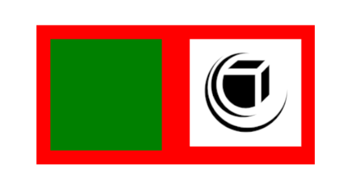
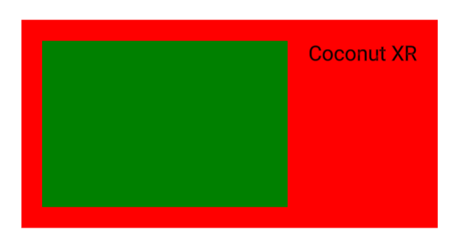
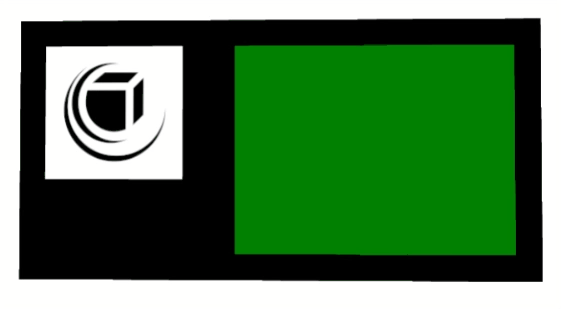
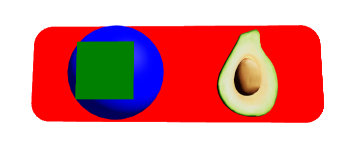
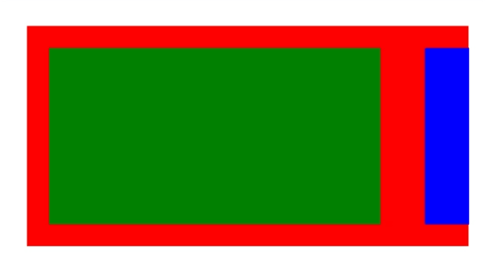

# Getting Started

In the following tutorials, we will create several UIs using **koestlich** and react-three/fiber. Each example provides a CodeSandbox containg the code.

## First Layout

At first, we will create 3 containers. One container is the root node, expressed by `RootContainer`. The `RootContainer` has a horizontal (row) flex-direction, while the children expressed by `Container` equally fill its width with a margin between them.

In addition to normal css properties, the `RootContainer` also needs a function to `loadYoga`. Yoga can be manually provided from `yoga-wasm-web` via wasm or asm.js or a BASE64 version of the code can be loaded from `@coconut-xr/flex`.

[CodeSandbox](https://codesandbox.io/s/koestlich-first-layout-owgw9d?file=/src/app.tsx)


```tsx
import { Canvas } from "@react-three/fiber";
import { OrbitControls } from "@react-three/drei";
import { RootContainer, Container } from "@coconut-xr/koestlich";
import { loadYoga } from "@coconut-xr/flex";

export default function Index() {
  return (
    <Canvas>
      <OrbitControls />
      <RootContainer
        loadYoga={loadYoga}
        backgroundColor="red"
        width={2}
        height={1}
        flexDirection="row"
      >
        <Container flexGrow={1} padding={0.1} backgroundColor="green" />
        <Container flexGrow={1} padding={0.1} backgroundColor="blue" />
      </RootContainer>
    </Canvas>
  );
}
```

## Asynchronous Content

**Koestlich** provides the components Text, Image, GLTF, and SVG, which load their content asynchronously. The components use the Suspense API from react to handle the loading state. This allows the components to be wrapped in a Suspense component to display a fallback element while loading.

The asynchronous loading can lead to inconsistent ordering. **Koestlich** can enforce a specific order of components, by setting the `index` parameter.

The `index` parameter can also be used to reorder elements independent of how they are expressed in react.


[CodeSandbox](https://codesandbox.io/s/koestlich-async-content-1fyyhw?file=/src/app.tsx)


```tsx
import { RootContainer, Container, Image } from "@coconut-xr/koestlich";
import { OrbitControls } from "@react-three/drei";
import { Canvas } from "@react-three/fiber";
import { loadYoga } from "@coconut-xr/flex";
import { Suspense } from "react";

export default function App() {
  return (
    <Canvas>
      <OrbitControls />
      <RootContainer
        loadYoga={loadYoga}
        backgroundColor="red"
        width={2}
        height={1}
        flexDirection="row"
      >
        <Container
          index={0}
          flexGrow={1}
          margin={0.1}
          backgroundColor="green"
        />
        <Suspense>
          <Image
            index={1}
            flexBasis={0}
            flexGrow={1}
            margin={0.1}
            url="example.png"
          />
        </Suspense>
      </RootContainer>
    </Canvas>
  );
}

```

## Text

The Text component enables rendering text using multi-channel signed distance functions (MSDF). A font can be rendered by compiling a .ttf file to an MSDF representation as a JSON and a corresponding texture. We provide a set of precompiled MSDF fonts. In the following, a Text is rendered with the Roboto font family.

[CodeSandbox](https://codesandbox.io/s/koestlich-text-b8ymnm?file=/src/app.tsx)


```tsx
import { Canvas } from "@react-three/fiber";
import { OrbitControls } from "@react-three/drei";
import { RootContainer, Container, Text } from "@coconut-xr/koestlich";
import { Suspense } from "react";
import { loadYoga } from "@coconut-xr/flex";

export default function Index() {
  return (
    <Canvas>
      <OrbitControls />
      <RootContainer
        loadYoga={loadYoga}
        backgroundColor="red"
        width={2}
        height={1}
        flexDirection="row"
      >
        <Container
          index={0}
          flexGrow={1}
          margin={0.1}
          backgroundColor="green"
        />
        <Suspense>
          <Text index={1} margin={0.1} marginLeft={0}>
            Coconut XR
          </Text>
        </Suspense>
      </RootContainer>
    </Canvas>
  );
}
```

Via the `FontFamilyProvider` additional MSDF fonts can be added.

```tsx
<FontFamilyProvider
  fontFamilies={{
    otherFont: ["<baseUrl>", "<pathToJson>"]
  }}
  defaultFontFamily="otherFont"
></FontFamilyProvider>
```

## Animations

Animations are built into **koestlich**, and they work out of the box. The animation behavior of every component can be controlled via the animation property, which allows controlling the animation computation and the birth and death animations. The default behavior is fade in and out by opacity and a distance-based animation computation. The following example shows how the state is controlled via a button, which changes the ordering of components via the index parameter and and animates the button's color between green and red.


[CodeSandbox](https://codesandbox.io/s/koestlich-animations-gnthy9?file=/src/app.tsx)


```tsx
import { Canvas } from "@react-three/fiber";
import { OrbitControls } from "@react-three/drei";
import { RootContainer, Container, Image } from "@coconut-xr/koestlich";
import { Suspense, useState } from "react";
import { loadYoga } from "@coconut-xr/flex";

export default function Index() {
  const [state, setState] = useState(true);
  return (
    <Canvas>
      <OrbitControls />
      <RootContainer
        loadYoga={loadYoga}
        backgroundColor="black"
        width={2}
        height={1}
        flexDirection="row"
      >
        <Container
          index={0}
          id="btn"
          onClick={() => setState(!state)}
          flexGrow={state ? 2 : 1}
          margin={0.1}
          backgroundColor={state ? "green" : "red"}
        />
          <Suspense>
            <Image
              index={state ? -1 : 1}
              id="img"
              flexBasis={0}
              flexGrow={1}
              margin={0.1}
              url="example.png"
            />
          </Suspense>
      </RootContainer>
    </Canvas>
  );
}
```

## 3D Content

Since **Koestlich** is a 3D UI library, it supports 3D content like GLTFs or any custom Three.js geometry and material. The following example shows how to use the `GLTF` component to directly import a 3D model, and how to use the `Object` component to insert a object with a `SphereGeomerty` and a `MeshPhongMaterial` into the layout.

[CodeSandbox](https://codesandbox.io/s/koestlich-3d-content-153ljq?file=/src/app.tsx)


```typescript
import { RootContainer, Object, GLTF, Container } from "@coconut-xr/koestlich";
import { OrbitControls } from "@react-three/drei";
import { Canvas } from "@react-three/fiber";
import { loadYoga } from "@coconut-xr/flex";
import { Suspense, useMemo } from "react";
import { Mesh, MeshPhongMaterial, SphereBufferGeometry } from "three";

export default function App() {
  const sphere = useMemo(
    () =>
      new Mesh(
        new SphereBufferGeometry(),
        new MeshPhongMaterial({ toneMapped: false, color: "blue" })
      ),
    []
  );

  return (
    <Canvas>
      <directionalLight position={[1, 1, 1]} intensity={2} />
      <ambientLight intensity={0.1} />
      <OrbitControls />
      <RootContainer
        loadYoga={loadYoga}
        backgroundColor="red"
        width={3}
        height={1}
        borderRadius={0.2}
        flexDirection="row"
        overflow="hidden"
        justifyContent="space-evenly"
        padding={0.1}
      >
        <Object aspectRatio={1} index={0} object={sphere} padding={0.2}>
          <Container flexGrow={1} backgroundColor="green" />
        </Object>
        <Suspense>
          <GLTF index={1} url="Avocado.glb" />
        </Suspense>
      </RootContainer>
    </Canvas>
  );
}
```

## Overflow, Scroll, and Clipping

**Koestlich** handles clipping and scrolling for you. You only need to specify overflow "scroll" or "hidden" on any container. First, however, we need to configure react-three/fiber to support visual clipping and clipping of events, which is done via `<Canvas events={clippingEvents} gl={{ localClippingEnabled: true }}>`.

[CodeSandbox](https://codesandbox.io/s/koestlich-overflow-c9nkvc?file=/src/app.tsx)


```tsx
import { Canvas } from "@react-three/fiber";
import { OrbitControls } from "@react-three/drei";
import {
  RootContainer,
  Container,
  clippingEvents
} from "@coconut-xr/koestlich";
import { loadYoga } from "@coconut-xr/flex";

export default function Index() {
  return (
    <Canvas events={clippingEvents} gl={{ localClippingEnabled: true }}>
      <OrbitControls enableRotate={false} />
      <RootContainer
        loadYoga={loadYoga}
        backgroundColor="red"
        width={2}
        height={1}
        flexDirection="row"
        overflow="scroll"
      >
        <Container width={1.5} margin={0.1} backgroundColor="green" />
        <Container width={1.5} margin={0.1} backgroundColor="blue" />
      </RootContainer>
    </Canvas>
  );
}
```
