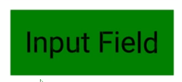

# Getting Started

In the following tutorials, we will create several UIs using **koestlich** and react-three/fiber. Install the dependencies manually via `npm i @coconut-xr/koestlich @react-three/fiber react react-dom three` or use the CodeSandbox provided for each example.

## First Layout

At first, we will create 3 containers. One container is the root node, expressed by `RootContainer`. The `RootContainer` has a horizontal (row) flex-direction, while the children expressed by `Container` equally fill its width with a margin between them.

In addition to normal CSS properties, the `RootContainer` also needs a function to `loadYoga`. Yoga can be manually provided from `yoga-wasm-web` via wasm or asm.js to safe space, or the 30% bigger BASE64 encoded code can be loaded from `@coconut-xr/flex`.

[CodeSandbox](https://codesandbox.io/s/koestlich-first-layout-owgw9d?file=/src/app.tsx)


```tsx
import { Canvas } from "@react-three/fiber";
import { OrbitControls } from "@react-three/drei";
import { RootContainer, Container } from "@coconut-xr/koestlich";
import { loadYoga } from "@coconut-xr/flex";

export default function App() {
  return (
    <Canvas>
      <OrbitControls />
      <RootContainer
        loadYoga={loadYoga}
        backgroundColor="red"
        width={2}
        height={1}
        flexDirection="row"
      >
        <Container flexGrow={1} margin={0.1} backgroundColor="green" />
        <Container flexGrow={1} margin={0.1} backgroundColor="blue" />
      </RootContainer>
    </Canvas>
  );
}
```

## Asynchronous Content

**Koestlich** provides Text, Image, GLTF, and SVG components, which load their content asynchronously. The components use the Suspense API from react to handle the loading state. This allows the components to be wrapped in a Suspense component to display a fallback element while loading.

The asynchronous loading can lead to inconsistent ordering. **Koestlich** can enforce a specific order of components by setting the `index` parameter.

The `index` parameter can also be used to reorder elements independent of how they are expressed in react.


[CodeSandbox](https://codesandbox.io/s/koestlich-async-content-1fyyhw?file=/src/app.tsx)


```tsx
import { RootContainer, Container, Image } from "@coconut-xr/koestlich";
import { OrbitControls } from "@react-three/drei";
import { Canvas } from "@react-three/fiber";
import { loadYoga } from "@coconut-xr/flex";
import { Suspense } from "react";

export default function App() {
  return (
    <Canvas>
      <OrbitControls />
      <RootContainer
        loadYoga={loadYoga}
        backgroundColor="red"
        width={2}
        height={1}
        flexDirection="row"
      >
        <Container
          index={0}
          flexGrow={1}
          margin={0.1}
          backgroundColor="green"
        />
        <Suspense>
          <Image
            index={1}
            flexBasis={0}
            flexGrow={1}
            margin={0.1}
            url="example.png"
          />
        </Suspense>
      </RootContainer>
    </Canvas>
  );
}

```

## Text

The Text component enables rendering text using multi-channel signed distance functions (MSDF). A font can be from a .ttf file to an MSDF representation as a JSON and a corresponding texture using [`msdf-bmfont-xml`](https://www.npmjs.com/package/msdf-bmfont-xml). We provide a set of precompiled MSDF fonts from [here](https://github.com/coconut-xr/msdf-fonts). In the following, a Text is rendered with the Roboto font family.

[CodeSandbox](https://codesandbox.io/s/koestlich-text-b8ymnm?file=/src/app.tsx)


```tsx
import { Canvas } from "@react-three/fiber";
import { OrbitControls } from "@react-three/drei";
import { RootContainer, Container, Text } from "@coconut-xr/koestlich";
import { Suspense } from "react";
import { loadYoga } from "@coconut-xr/flex";

export default function App() {
  return (
    <Canvas>
      <OrbitControls />
      <RootContainer
        loadYoga={loadYoga}
        backgroundColor="red"
        width={2}
        height={1}
        flexDirection="row"
      >
        <Container
          index={0}
          flexGrow={1}
          margin={0.1}
          backgroundColor="green"
        />
        <Suspense>
          <Text index={1} margin={0.1} marginLeft={0}>
            Coconut XR
          </Text>
        </Suspense>
      </RootContainer>
    </Canvas>
  );
}
```

Via the `FontFamilyProvider`, additional MSDF fonts can be added.

```tsx
<FontFamilyProvider
  fontFamilies={{
    otherFont: ["<baseUrl>", "<pathToJson>"]
  }}
  defaultFontFamily="otherFont"
></FontFamilyProvider>
```

For text fields and text areas, we provide the [@coconut-xr/input](https://github.com/coconut-xr/input) library.

[CodeSandbox](https://codesandbox.io/s/koestlich-input-example-4ubrt0?file=/src/app.tsx)



## Animations

Animations are built into **koestlich** and work out of the box. The animation behavior of every component can be controlled via the animation property, which allows controlling the animation computation and the birth and death animations. The default behavior is fade in and out by opacity and a distance-based animation computation. The following example shows how the state is controlled via a button, which changes the ordering of components via the index parameter and animates the button's color between green and red.


[CodeSandbox](https://codesandbox.io/s/koestlich-animations-gnthy9?file=/src/app.tsx)


```tsx
import { Canvas } from "@react-three/fiber";
import { OrbitControls } from "@react-three/drei";
import { RootContainer, Container, Image } from "@coconut-xr/koestlich";
import { Suspense, useState } from "react";
import { loadYoga } from "@coconut-xr/flex";

export default function App() {
  const [state, setState] = useState(true);
  return (
    <Canvas>
      <OrbitControls />
      <RootContainer
        loadYoga={loadYoga}
        backgroundColor="black"
        width={2}
        height={1}
        flexDirection="row"
      >
        <Container
          index={0}
          id="btn"
          onClick={() => setState(!state)}
          flexGrow={state ? 2 : 1}
          margin={0.1}
          backgroundColor={state ? "green" : "red"}
        />
          <Suspense>
            <Image
              index={state ? -1 : 1}
              id="img"
              flexBasis={0}
              flexGrow={1}
              margin={0.1}
              url="example.png"
            />
          </Suspense>
      </RootContainer>
    </Canvas>
  );
}
```

## 3D Content

The previous examples showed 2D elements positioned in the x/y plane. Integrating 3D geometries into the UI will make use of the z-Axis. In addition to having width and height, all components now have depth, which is their size on the z-Axis. All UI elements will be placed in front of their parent along the z-Axis.


[<small>Image Source</small>](https://mayaposch.wordpress.com/2012/12/17/on-the-coordinate-system-of-qgraphicsscene-in-qt/opengl_coordinate_system/)

**Koestlich** supports any Three.js geometry and material. The following example shows how to use the `GLTF` component to import a 3D model directly and how to use the `Object` component to insert an object with a `SphereGeomerty` and a `MeshPhongMaterial` into the layout.

[CodeSandbox](https://codesandbox.io/s/koestlich-3d-content-153ljq?file=/src/app.tsx)


```tsx
import { RootContainer, Object, GLTF, Container } from "@coconut-xr/koestlich";
import { OrbitControls } from "@react-three/drei";
import { Canvas } from "@react-three/fiber";
import { loadYoga } from "@coconut-xr/flex";
import { Suspense, useMemo } from "react";
import { Mesh, MeshPhongMaterial, SphereBufferGeometry } from "three";

export default function App() {
  const sphere = useMemo(
    () =>
      new Mesh(
        new SphereBufferGeometry(),
        new MeshPhongMaterial({ toneMapped: false, color: "blue" })
      ),
    []
  );

  return (
    <Canvas>
      <directionalLight position={[1, 1, 1]} intensity={2} />
      <ambientLight intensity={0.1} />
      <OrbitControls />
      <RootContainer
        loadYoga={loadYoga}
        backgroundColor="red"
        width={3}
        height={1}
        borderRadius={0.2}
        flexDirection="row"
        overflow="hidden"
        justifyContent="space-evenly"
        padding={0.1}
      >
        <Object aspectRatio={1} index={0} object={sphere} padding={0.2}>
          <Container flexGrow={1} backgroundColor="green" />
        </Object>
        <Suspense>
          <GLTF index={1} url="Avocado.glb" />
        </Suspense>
      </RootContainer>
    </Canvas>
  );
}
```

Our example dashboard interface can be built using `ExtrudeGeometry` from three.js and the SVGs from any icon library. However, we use the `SVGLoader` code from the three.js/examples, which has limited features.

[CodeSandbox](https://codesandbox.io/s/koestlich-rounded-box-svg-1r3myd?file=/src/app.tsx)


```tsx
import { RootContainer, Object, SVG } from "@coconut-xr/koestlich";
import { OrbitControls } from "@react-three/drei";
import { Canvas } from "@react-three/fiber";
import { loadYoga } from "@coconut-xr/flex";
import { ExtrudeGeometry, Shape, Mesh, MeshPhongMaterial } from "three";
import { Suspense, useMemo } from "react";

export default function App() {
  const mesh1 = useMemo(() => new Mesh(new CardGeometry(1, 1, 0.1),new MeshPhongMaterial({
      toneMapped: false,
      transparent: true
    })), []);
  const mesh2 = useMemo(() => new Mesh(new CardGeometry(1, 1, 0.1),new MeshPhongMaterial({
      toneMapped: false,
      transparent: true
    })), []);
  const mesh3 = useMemo(() => new Mesh(new CardGeometry(1, 1, 0.1),new MeshPhongMaterial({
      toneMapped: false,
      transparent: true
    })), []);
  return (
    <Canvas>
      <OrbitControls />
      <ambientLight intensity={0.5} />
      <directionalLight intensity={0.8} position={[1, 1, 1]} />
      <RootContainer
        loadYoga={loadYoga}
        backgroundColor="black"
        width={2}
        height={1}
        flexDirection="row"
      >
        <Object
          depth={0.1}
          object={mesh1}
          {...}
        >
          <Suspense>
            <SVG url="bank.svg" flexShrink={1} depth={0} />
          </Suspense>
        </Object>
        <Object
          depth={0.1}
          object={mesh2}
          {...}
        >
          <Suspense>
            <SVG url="message.svg" flexShrink={1} depth={0} />
          </Suspense>
        </Object>
        <Object
          depth={0.1}
          object={mesh3}
          {...}
        >
          <Suspense>
            <SVG url="clock.svg" flexShrink={1} depth={0} />
          </Suspense>
        </Object>
      </RootContainer>
    </Canvas>
  );
}

class CardGeometry extends ExtrudeGeometry {
  constructor(width: number, height: number, radius: number) {
    const roundedRectShape = new Shape();
    roundedRectShape.moveTo(0, radius);
    roundedRectShape.lineTo(0, height - radius);
    roundedRectShape.quadraticCurveTo(0, height, radius, height);
    roundedRectShape.lineTo(width - radius, height);
    roundedRectShape.quadraticCurveTo(width, height, width, height - radius);
    roundedRectShape.lineTo(width, radius);
    roundedRectShape.quadraticCurveTo(width, 0, width - radius, 0);
    roundedRectShape.lineTo(radius, 0);
    roundedRectShape.quadraticCurveTo(0, 0, 0, radius);
    super(roundedRectShape, { depth: 1, bevelEnabled: false });
  }
}
```

## Overflow, Scroll, and Clipping

**Koestlich** handles clipping and scrolling for you. You only need to specify overflow "scroll" or "hidden" on any container. First, however, we need to configure react-three/fiber to support visual clipping and clipping of events, which is done via `<Canvas events={clippingEvents} gl={{ localClippingEnabled: true }}>`.

[CodeSandbox](https://codesandbox.io/s/koestlich-overflow-c9nkvc?file=/src/app.tsx)


```tsx
import { Canvas } from "@react-three/fiber";
import { OrbitControls } from "@react-three/drei";
import {
  RootContainer,
  Container,
  clippingEvents
} from "@coconut-xr/koestlich";
import { loadYoga } from "@coconut-xr/flex";

export default function App() {
  return (
    <Canvas events={clippingEvents} gl={{ localClippingEnabled: true }}>
      <OrbitControls enableRotate={false} />
      <RootContainer
        loadYoga={loadYoga}
        backgroundColor="red"
        width={2}
        height={1}
        flexDirection="row"
        overflow="scroll"
      >
        <Container width={1.5} margin={0.1} backgroundColor="green" />
        <Container width={1.5} margin={0.1} backgroundColor="blue" />
      </RootContainer>
    </Canvas>
  );
}
```
